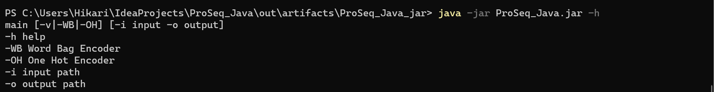
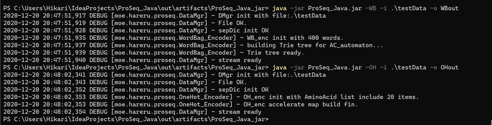
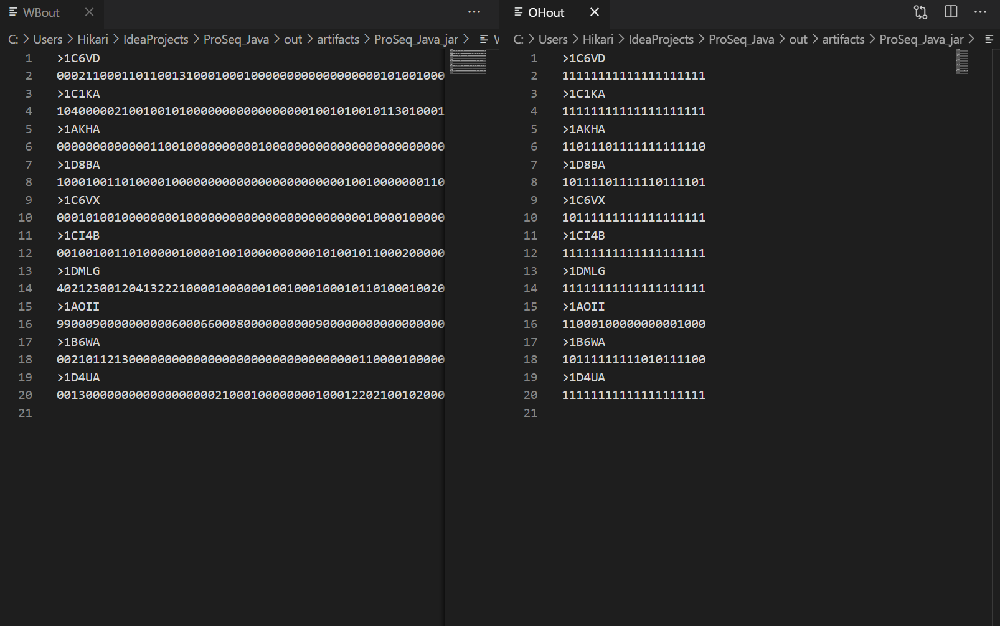
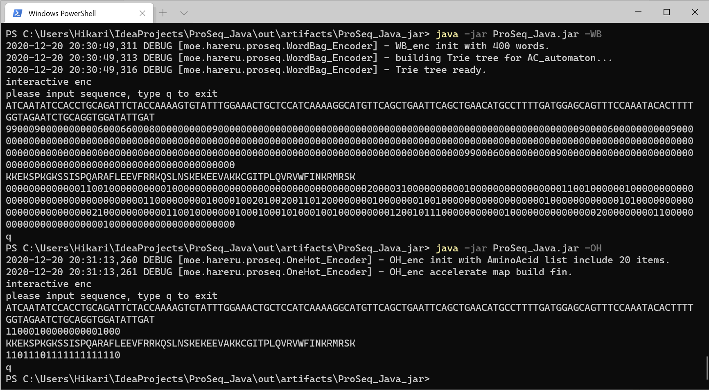
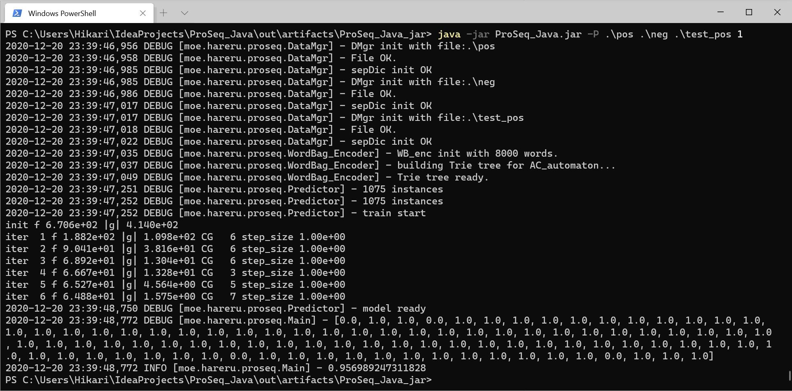

ProSeq_Java docs
===========

项目简介
--------
蛋白质在生物的生命活动中起着不可或缺的重要作用。但由于功能往往由其次级结构决定着，我们很难仅通过氨基酸序列推断出蛋白质的作用。
然而，氨基酸片段间的修饰关系与自然语言词汇有着非常相似的特征。因此，可以通过在自然语言处理中常见的编码方式，将较难直接作为特征使用的氨基酸序列转化为多维向量，进而便于进一步的分类、学习与预测。

实现方法
--------
###Data Manager
本模块的功能是从文件读取fasta格式的蛋白质序列并提供访问方式。  
通过传入`Path`类型参数构造，使用`scanner`利用正则表达式分割文件，并存入`Map<String, String>`中。  
提供大小查询、指定key查询和全量查询等多种访问方式。  
此外，亦可通过传入一个Encoder对象和一个输出路径实现编码结果输出。
###Encoder接口
Encoder接口声明了一个返回字符串或字符串数组的Encode函数，返回编码器的编码结果.  
当以字符串形式返回特征向量时，任何维度的值不会超过9。
####One Hot Encoder
本类提供两种工作模式，通过构造函数参数重载区分。  
+ 在仅传入一个包含须统计氨基酸字符串时，模块使用`Kmer=1`下的加速模式。通过初始化静态加速表，实现高速统计。
+ 在传入包含多个分词的字符串数组时，模块使用`Word Bag Encoder`实例来进行统计。详见下文。
####Word Bag Encoder
本类使用AC自动机，通过带负载字典树来实现对多目标串的同时可重叠匹配。  
AC自动机使用外部库。因该库`Maven`内版本过老，故将源码编译为jar置入`/lib`下。  
构造函数需传入目标子串，在构造时完成AC自动机的初始化。
###Predictor
本类负责基于liblinear进行结果预测。
###utils
####WB_builder
传入字符集和长度，返回该长度下字符集的全排列。
###test
本项目采用了模块测试的思想，使用`Junit5`测试框架为每个模块编写了对应的单元测试
###logger
本项目采用`slf4j`做日志工具。默认日志等级为`DEBUG`。

实验结果与分析
--------
```
java -jar ProSeq_Java.jar [-h|-WB|-OH|-P] [-i input -o output]
-h help
-WB Word Bag Encoder
-OH One Hot Encoder
-i input path
-o output path
-P predict mode
```
>使用-h或无参数调用会输出帮助信息。  



>`-WB/-OH`选择编码器
如果包含`-i -o`，会进入文件处理模式，由指定文件读取，编码后输出到文件。  




>否则进入交互式编码模式，由命令行输入获取序列并输出到命令行.

>>此截图为便于观看使用了较小的参数初始化编码器

>`-P`进入分类器模式  
> 本模式依次接受 positive bench path、negative bench path、test data path、result expected四个参数

> 输出为预测结果数组与准确率，输出方式为logger.info通过命令行输出。

附录
-------
###环境
本项目使用`JDK15`为环境。具体依赖见项目结构。
###开发平台
```
IntelliJ IDEA 2020.3 (Ultimate Edition)  
内部版本号 #IU-203.5981.155, 构建于 December 1, 2020  
运行时版本: 11.0.9+11-b1145.21 amd64  
JVM: OpenJDK 64-Bit Server VM by JetBrains s.r.o.  
```
###项目内容
本项目最终文件为一个IntelliJ IDEA项目。其中仅有一个jar作为构建结果，位于`ProSeq_Java\out\artifacts\ProSeq_Java_jar`下。  
如仅运行jar，仅需要JDK15作为运行环境。  
如需编译/测试项目，需要以下步骤：
1. 使用IDEA加载项目
2. 打开Git选项卡下“管理远程”项，选中其中的VCS条目并删除
3. 等待IDEA加载Maven依赖
###调用方法
1. 安装JDK15并通过`java -version`确认已加入PATH  
2. 复制jar至该机  
3. <kbd>Win</kbd>+<kbd>R</kbd>，输入`Powershell`并回车
4. `cd`切换至jar所在目录
5. `java -jar ProSeq_Java.jar ...`调用
